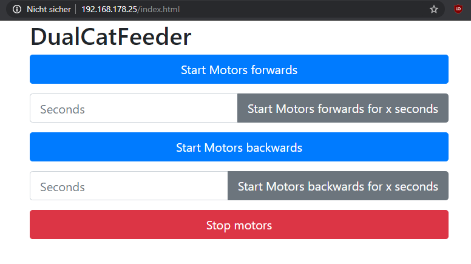
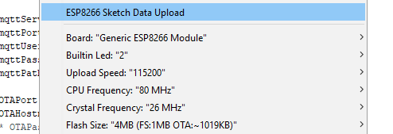

# DualCatFeeder - Arduino
There are some ways to control the cat feeder. On the one hand you can use MQTT to do specific actions and on the other hand WebSocket, which is used to power the provided web interface but can of course used to develop own integrations.


To upload the files provided in the data directory, i've used the ESP8266FS plugin from here https://github.com/esp8266/arduino-esp8266fs-plugin

Just follow the install instructions and use the new button in your Arduino IDE to upload the webserver files.



## Websocket
Just establish a WebSocket connection to port 81 of your ESP8266 and send some commands formatted as JSON to your cat feeder.
```json
{
    "action": "[forwards|backwards|stop]",
    "time"  : ""
}
```

## MQTT